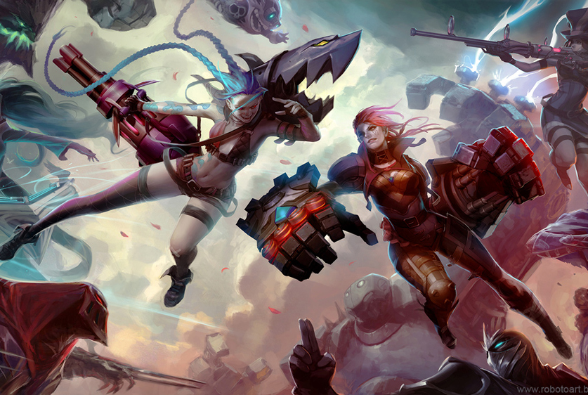

UNNUO 2017
===


1. Gulp 工程化

  ```bash
  npm config edit
  registry=https://registry.npm.taobao.org
  npm install gulp -g
  npm install gulp --save-dev
  创建gulpfile.js,并配置
  ```

2. Scss,Sass,Less 预编译 ,合并, 压缩代码

  ```bash
  npm install gulp-sass gulp-sourcemap --save-dev
  npm install gulp-concat-css --save-dev
  ```

3. ES6 预编译 ,合并, 压缩代码

  ```bash
  npm install gulp-babel babel-preset-env --save-dev
  npm install gulp-concat --save-dev
  npm install ugly --save-dev
  ```

4. clean task 其它任务执行之前的清理，上线之前，清理未压缩文件和map文件

  ```bash
  npm install gulp-clean --save-dev
  ```

5. Karma + Jasmime 单元测试

  ```bash npm install karma-cli -g npm install karma --save-dev

  karma init

  配置 karma.conf.js , 添加 coverage reports

  karma start

````
```
````

1. CSS,JS代码合并，生成sourcemap

2. 图片压缩

3. 搭建协作开发环境
